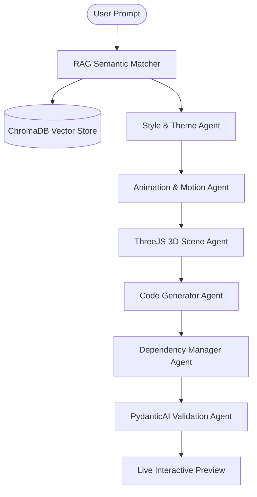
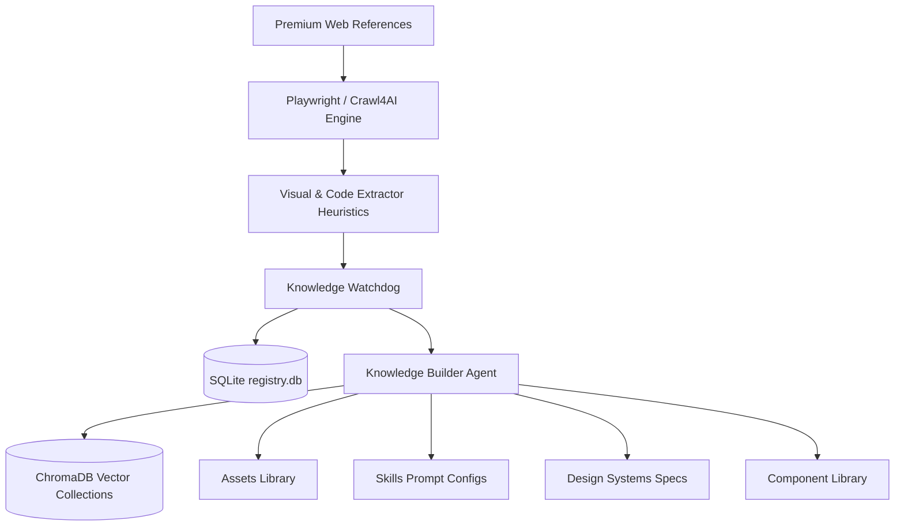

<div align="center">

# 🌌 Helix UI
### *Autonomous Interface Engineering Engine*

🤖 **Learn Continually. Synthesize Dynamically. Render Flawlessly.**

---

[](https://github.com/ViniciusCostaGrillo/helix-ui)
[](LICENSE)
[](https://github.com/ViniciusCostaGrillo/helix-ui/stargazers)
[](https://github.com/ViniciusCostaGrillo/helix-ui/commits/master)
[](https://github.com/ViniciusCostaGrillo/helix-ui/issues)

[](https://www.docker.com/)
[](https://www.python.org/)
[](https://www.typescriptlang.org/)

[🇧🇷 Leia a versão em Português (README.pt-BR.md)](README.pt-BR.md)

</div>

---

## 📖 Table of Contents
1. [🌌 About the Project](#-about-the-project)
2. [💡 Key Features](#-key-features)
3. [🏗️ Architecture Flow](#️-architecture-flow)
4. [📁 Folder Structure](#-folder-structure)
5. [🛠️ Tech Stack](#️-tech-stack)
6. [👑 Masterpiece Engine](#-masterpiece-engine)
7. [📈 Knowledge Base Growth](#-knowledge-base-growth)
8. [🗺️ Roadmap](#️-roadmap)
9. [📸 Interface Preview](#-interface-preview)
10. [⚙️ Installation & Setup](#️-installation---setup)
11. [🧠 Local LLM & Ollama](#-local-llm---ollama)
12. [🔄 Ingestion & Promotion Workflows](#-ingestion---promotion-workflows)
13. [🤝 Contributing](#-contributing)
14. [📄 License](#-license)

---

## 🌌 About the Project

**Helix UI** is an autonomous interface engineering platform that continually crawls premium websites, extracts their underlying visual genetics, and dynamically synthesizes production-ready React + Tailwind CSS components. 

Unlike traditional generators that produce static, isolated blocks, Helix UI uses **Multi-Agent Orchestration (LangGraph & PydanticAI)**, **Retrieval-Augmented Generation (RAG)**, and **Computer Vision heuristics** to catalog design tokens, GSAP timelines, and Three.js configurations. 

Our long-term vision is to establish an autonomous, self-improving design engine capable of generating interactive experiences worthy of the **Awwwards** directly from natural language prompts.

---

## 💡 Key Features

<table width="100%">
  <tr>
    <td width="50%">
      <h4>🕷️ Autonomous Crawling</h4>
      <p>Headless browser integration parsing visual structures via Playwright, Crawl4AI, and Firecrawl.</p>
    </td>
    <td width="50%">
      <h4>🧠 Dynamic Vector RAG</h4>
      <p>Semantic indexing using ChromaDB and SentenceTransformer vector models matching prompts to optimal design nodes.</p>
    </td>
  </tr>
  <tr>
    <td width="50%">
      <h4>🎨 Style & Theme Agents</h4>
      <p>Resolves typography, spacing, glassmorphic filters, and luxury tokens across dark, light, and custom themes.</p>
    </td>
    <td width="50%">
      <h4>🎬 Advanced Motion Engine</h4>
      <p>Extracts, optimizes, and writes GSAP timelines, Lottie setups, and custom parallax components.</p>
    </td>
  </tr>
  <tr>
    <td width="50%">
      <h4>🧊 Immersive 3D Engine</h4>
      <p>Generates React Three Fiber (R3F) scenes, particle systems, and WebGL GLSL shaders on the fly.</p>
    </td>
    <td width="50%">
      <h4>📥 Knowledge Watchdog</h4>
      <p>A background folder monitor (<code>knowledge_input/</code>) that auto-sorts code and assets into corresponding libraries.</p>
    </td>
  </tr>
  <tr>
    <td width="50%">
      <h4>📦 Dependency Manager</h4>
      <p>Checks peer dependencies, validates NPM versions, and prevents React framework bundling conflicts.</p>
    </td>
    <td width="50%">
      <h4>🎛️ Local LLM Support</h4>
      <p>Native integration with Ollama (Qwen 2.5 Coder, Llama 3.1, DeepSeek) for zero-cost local execution.</p>
    </td>
  </tr>
</table>

---

## 🏗️ Architecture Flow

### Generation Pipeline


### Ingestion & Watchdog Pipeline


---

## 📁 Folder Structure

```text
helix-ui/
├── backend/                    # Python FastAPI Backend Services
│   ├── agents/                 # Multi-agent engines (LangGraph, PydanticAI, Agno)
│   ├── analyzer/               # LLM layout analytics & prompt synthesizers
│   ├── api/                    # REST routers (generation, crawler, knowledge, etc.)
│   ├── assets/                 # Gradients, textures, icons, and videos presets
│   ├── codegen/                # React components code synthesizers
│   ├── crawler/                # Scraping engines (Playwright, Crawl4AI, Firecrawl)
│   ├── database/               # PostgreSQL & SQLite session wrappers & models
│   ├── dependencies/           # NPM version solvers & package registries
│   ├── extractor/              # DOM structures & CSS parsing algorithms
│   ├── knowledge/              # Watchdog, registry, and Prefect Daily Flows
│   ├── motion/                 # GSAP animations & microinteractions engines
│   ├── rag/                    # SentenceTransformer embeddings & ChromaDB service
│   ├── schemas/                # Pydantic schema validation wrappers
│   ├── threejs/                # React Three Fiber & WebGL GLSL shaders agents
│   ├── training/               # Fine-tuning compilers & PEFT adapters models
│   └── utils/                  # Test suites, tracers, loggers, and retry decoraters
├── frontend/                   # Next.js App Router UI Dashboard
├── dataset/                    # Ingested website pages & manifest packages
├── knowledge_input/            # Monitored directory structure for drag-and-drop
├── component_library/          # Categorized react components library outputs
├── design_systems/             # Generated style-specific parameters configuration
├── docker/                     # Dockerfiles deployment specs
└── storage/                    # SQLite database files, ChromaDB PersistentClient indexes
```

---

## 🛠️ Tech Stack

| Category | Technology |
| :--- | :--- |
| **Frontend** | Next.js (v15), React, TypeScript, Tailwind CSS, shadcn/ui |
| **Backend** | Python 3.12, FastAPI, SQLAlchemy ORM |
| **Multi-Agent** | LangGraph, PydanticAI, Agno (formerly Phidata) |
| **Parsing & Crawling** | Playwright, Crawl4AI, Firecrawl SDK, BeautifulSoup4, Trafilatura |
| **AI Databases** | ChromaDB (Vector DB), SQLite (Ingestion Registry), PostgreSQL (Core Transactional) |
| **Queue & Caching** | Redis, Priority Worker Queues |
| **Orchestration** | Prefect, Apache Airflow |
| **Animations & 3D** | GSAP, React Three Fiber (Three.js), WebGL GLSL, Lenis scroll |
| **Infrastructure** | Docker, Docker Compose |

---

## 👑 Masterpiece Engine

Our system utilizes the **Masterpiece Engine** to assign higher heuristic weight weights to premium web references during the RAG lookup. These premium sites serve as the "professors" of the generator, teaching the agents state-of-the-art interactive techniques.

```text
┌────────────────────────────────────────────────────────┐
│              Masterpiece Weights Mapping               │
├────────────────────────────────────────────────────────┤
│  • Stripe / Vercel        ──► Structural layouts & UI  │
│  • Linear / Refokus       ──► Dark glassmorphic grids  │
│  • Obys / Active Theory   ──► WebGL shaders & GSAP     │
│  • Elara / NoirFrame      ──► Immersive 3D components  │
└────────────────────────────────────────────────────────┘
```

---

## 📈 Knowledge Base Growth

As the system ingests references, the vector space expands. Below is the projected dataset matrix of our local engine:

```text
[ 100 Premium Sites Ingested ] 
   └── 10,000 React Components Synthesized
   └── 50,000 Premium Assets Registered
   └── 100,000 Dense Vector Embeddings Indexer
   └── 500 Skill Maps & 2,000 Style Configs compiled
```

---

## 🗺️ Roadmap

```text
Fase 1 ──► Scaffolding & Git Init                                 (Done)
Fase 5 ──► DB Models & Relational Schemas                         (Done)
Fase 10 ──► LLM Layout Analyzer Engine                            (Done)
Fase 15 ──► Multi-Agent Frameworks Integration                    (Done)
Fase 20 ──► Vector RAG Integrations                               (Done)
Fase 26 ──► Advanced Motion Engine (GSAP & ThreeJS Shaders)       (Done)
Fase 27 ──► Knowledge Ingestion watchdog & Drag-and-Drop Uploader (Done)
Fase 28+ ──► Autonomous Self-Improving Loop Awwwards Generator    (Coming Soon)
```

---

## 📸 Interface Preview

Here are the placeholders representing our visual Next.js panels:

```text
┌────────────────────────────────────────────────────────────────────────────┐
│  Dashboard Header                                       [Workers Active]   │
├────────────────────────────────────────────────────────────────────────────┤
│  [Projects Explorer]  │ [Drag & Drop Files Here]                           │
│  [Editor & Preview]   │  ├── components/    (tsx, jsx)                     │
│  [History Logs]       │  ├── design_systems/(yaml, json)                   │
│  [Vector RAG Console] │  └── assets/        (glb, png, mp4)                │
│                       ├────────────────────────────────────────────────────┤
│  [Knowledge Ingest]   │ Listed items sorted by folders directories         │
│  [Control Settings]   │ [components]    [design_systems]    [assets]       │
└────────────────────────────────────────────────────────────────────────────┘
```

---

## ⚙️ Installation & Setup

### Docker Deployment (Complete Stack)
To run the database engines, queues, vector client, and backend in containers:
```bash
docker compose up --build -d
```

### Manual Local Setup

#### 1. Backend (Python 3.12)
```bash
python -m venv .venv
source .venv/Scripts/activate   # On Windows: .venv\Scripts\Activate.ps1
pip install -r backend/requirements.txt
playwright install
```

#### 2. Frontend (Next.js)
```bash
cd frontend
npm install
npm run dev
```

#### 3. Environment Configs
Create a `.env` file in the root directory:
```env
DATABASE_URL="sqlite:///./test.db"
ANALYTICS_DATABASE_URL="sqlite:///./test_analytics.db"
OPENAI_API_KEY="ollama"
OPENAI_API_BASE="http://localhost:11434/v1"
OPENAI_MODEL_NAME="qwen2.5-coder:7b"
```

---

## 🧠 Local LLM & Ollama

Our ecosystem natively supports local execution to completely bypass API query costs:

1. Download Ollama from [ollama.com](https://ollama.com).
2. Pull the state-of-the-art coder model:
   ```bash
   ollama pull qwen2.5-coder:7b
   ```
3. Configure your local `.env` as shown above. The app agents will automatically redirect structural generations to your GPU (e.g. RTX 4070) via Ollama's OpenAI-compatible endpoint!

---

## 🔄 Ingestion & Promotion Workflows

### Watchdog Flow
```text
File Dropped in /components/
  └── Watchdog detects change 
  └── Computes hash & logs to SQLite registry
  └── Copy compiled component wrapper to Component Library
  └── Embed code via SentenceTransformers
  └── Upsert vector and metadata to ChromaDB Components collection
```

### Masterpiece Promotion
```text
Promote Site to Masterpiece 
  └── Run high-density crawler extraction
  └── Extract CSS variables, typography, and motion presets
  └── Generate corresponding skills.yaml prompt mapping
  └── Build design_system spec sheets
  └── Sync weights across vector collections for priority lookup
```

---

## 🤝 Contributing

We welcome contributions to help make this the premier open-source UI generator!
1. Fork the repository.
2. Create your feature branch (`git checkout -b feature/dynamic-particles`).
3. Commit your changes.
4. Push to the branch and open a Pull Request.

---

## 📄 License

Distributed under the MIT License. See [LICENSE](LICENSE) for more details.

---

<div align="center">

**Built with 🌌 by the Helix UI Community.**

[Vercel](https://vercel.com) • [OpenAI](https://openai.com) • [Supabase](https://supabase.com) • [LangChain](https://langchain.com)

</div>
