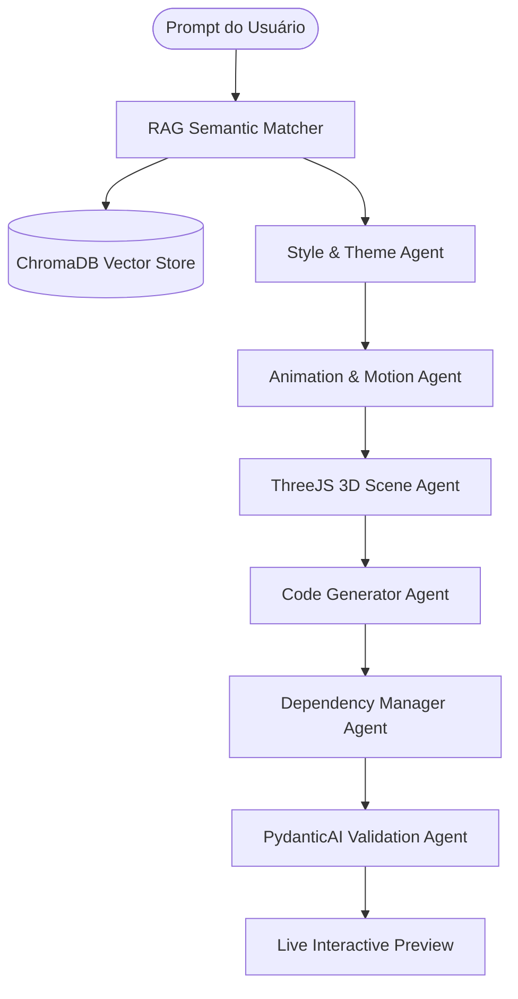
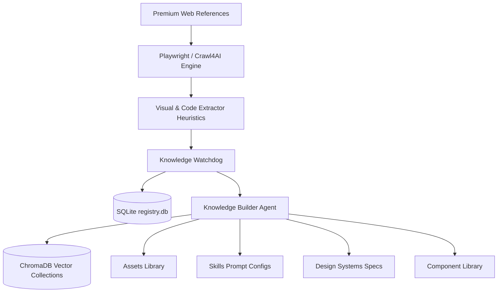

<div align="center">

# 🌌 Helix UI
### *Engine de Engenharia de Interfaces Autônoma*

🤖 **Aprenda Continuamente. Sintetize Dinamicamente. Renderize Perfeitamente.**

---

[](https://github.com/ViniciusCostaGrillo/helix-ui)
[](LICENSE)
[](https://github.com/ViniciusCostaGrillo/helix-ui/stargazers)
[](https://github.com/ViniciusCostaGrillo/helix-ui/commits/master)
[](https://github.com/ViniciusCostaGrillo/helix-ui/issues)

[](https://www.docker.com/)
[](https://www.python.org/)
[](https://www.typescriptlang.org/)

[🇺🇸 Read the English version (README.md)](README.md)

</div>

---

## 📖 Tabela de Conteúdos
1. [🌌 Sobre o Projeto](#-sobre-o-projeto)
2. [💡 Principais Funcionalidades](#-principais-funcionalidades)
3. [🏗️ Fluxo de Arquitetura](#️-fluxo-de-arquitetura)
4. [📁 Estrutura de Pastas](#-estrutura-de-pastas)
5. [🛠️ Stack Tecnológica](#️-stack-tecnologica)
6. [👑 Motor de Obras-Primas (Masterpiece Engine)](#-motor-de-obras-primas-masterpiece-engine)
7. [📈 Crescimento da Base de Conhecimento](#-crescimento-da-base-de-conhecimento)
8. [🗺️ Cronograma (Roadmap)](#️-cronograma-roadmap)
9. [📸 Pré-visualização da Interface](#-pre-visualizacao-da-interface)
10. [⚙️ Instalação e Configuração](#️-instalacao-e-configuracao)
11. [🧠 LLM Local e Ollama](#-llm-local-e-ollama)
12. [🔄 Fluxos de Ingestão e Promoção](#-fluxos-de-ingestao-e-promocao)
13. [🤝 Contribuição](#-contribuicao)
14. [📄 Licença](#-licenca)

---

## 🌌 Sobre o Projeto

O **Helix UI** é uma plataforma autônoma de engenharia de interfaces que rastreia continuamente sites premium, extrai sua genética visual e sintetiza dinamicamente componentes React + Tailwind CSS prontos para produção.

Ao contrário de geradores tradicionais que produzem blocos estáticos e isolados, o Helix UI utiliza **Orquestração Multi-Agente (LangGraph & PydanticAI)**, **Geração Aumentada de Recuperação (RAG)** e **heurísticas de Visão Computacional** para catalogar tokens de design, linhas de tempo do GSAP e configurações do Three.js.

Nossa visão de longo prazo é estabelecer um motor de design autônomo capaz de gerar experiências interativas dignas do **Awwwards** diretamente a partir de descrições em linguagem natural.

---

## 💡 Principais Funcionalidades

<table width="100%">
  <tr>
    <td width="50%">
      <h4>🕷️ Rastreamento Autônomo</h4>
      <p>Integração com navegadores headless que analisam estruturas visuais via Playwright, Crawl4AI e Firecrawl.</p>
    </td>
    <td width="50%">
      <h4>🧠 RAG de Vetores Dinâmico</h4>
      <p>Indexação semântica usando ChromaDB e modelos de vetores SentenceTransformers que mapeiam os prompts aos nós de design ideais.</p>
    </td>
  </tr>
  <tr>
    <td width="50%">
      <h4>🎨 Agentes de Estilo e Temas</h4>
      <p>Resolve tipografia, espaçamento, filtros glassmorphic e tokens de luxo em temas escuros, claros e personalizados.</p>
    </td>
    <td width="50%">
      <h4>🎬 Motor de Movimento Avançado</h4>
      <p>Extrai, otimiza e escreve timelines do GSAP, configurações do Lottie e componentes de paralaxe personalizados.</p>
    </td>
  </tr>
  <tr>
    <td width="50%">
      <h4>🧊 Motor 3D Imersivo</h4>
      <p>Gera cenas do React Three Fiber (R3F), sistemas de partículas e shaders WebGL GLSL em tempo real.</p>
    </td>
    <td width="50%">
      <h4>📥 Watchdog de Conhecimento</h4>
      <p>Um monitor de pasta em segundo plano (<code>knowledge_input/</code>) que organiza automaticamente códigos e assets em suas bibliotecas correspondentes.</p>
    </td>
  </tr>
  <tr>
    <td width="50%">
      <h4>📦 Gerenciador de Dependências</h4>
      <p>Verifica dependências de pacotes, valida versões do NPM e evita conflitos de compilação no React.</p>
    </td>
    <td width="50%">
      <h4>🎛️ Suporte a LLM Local</h4>
      <p>Integração nativa com o Ollama (Qwen 2.5 Coder, Llama 3.1, DeepSeek) para execução local de custo zero.</p>
    </td>
  </tr>
</table>

---

## 🏗️ Fluxo de Arquitetura

### Pipeline de Geração


### Pipeline de Ingestão e Watchdog


---

## 📁 Estrutura de Pastas

```text
helix-ui/
├── backend/                    # Serviços do Backend FastAPI em Python
│   ├── agents/                 # Motores multi-agente (LangGraph, PydanticAI, Agno)
│   ├── analyzer/               # Analisadores de layout LLM e sintetizadores de prompt
│   ├── api/                    # Roteadores REST (geração, crawler, conhecimento, etc.)
│   ├── assets/                 # Gráficos, texturas, ícones e presets de vídeos
│   ├── codegen/                # Sintetizadores de código de componentes React
│   ├── crawler/                # Motores de raspagem (Playwright, Crawl4AI, Firecrawl)
│   ├── database/               # Wrappers e modelos de sessão PostgreSQL & SQLite
│   ├── dependencies/           # Solucionadores de versão do NPM e registros de pacotes
│   ├── extractor/              # Estruturas do DOM e algoritmos de análise CSS
│   ├── knowledge/              # Watchdog, registros e fluxos diários do Prefect
│   ├── motion/                 # Motores de animação GSAP e microinterações
│   ├── rag/                    # Embeddings do SentenceTransformers e serviço ChromaDB
│   ├── schemas/                # Wrappers de validação de esquemas Pydantic
│   ├── threejs/                # React Three Fiber e agentes de shaders WebGL GLSL
│   ├── training/               # Compiladores de ajuste fino e modelos de adaptadores PEFT
│   └── utils/                  # Suítes de testes, rastreadores, loggers e retry decorators
├── frontend/                   # Dashboard da Interface Next.js App Router
├── dataset/                    # Pacotes de manifesto e páginas de sites ingeridas
├── knowledge_input/            # Estrutura de pasta monitorada para arrastar e soltar
├── component_library/          # Saídas da biblioteca de componentes React categorizados
├── design_systems/             # Configurações de parâmetros de design geradas
├── docker/                     # Especificações de implantação do Docker
└── storage/                    # Bancos SQLite e índices locais do ChromaDB PersistentClient
```

---

## 🛠️ Stack Tecnológica

| Categoria | Tecnologia |
| :--- | :--- |
| **Frontend** | Next.js (v15), React, TypeScript, Tailwind CSS, shadcn/ui |
| **Backend** | Python 3.12, FastAPI, SQLAlchemy ORM |
| **Multi-Agente** | LangGraph, PydanticAI, Agno (anteriormente Phidata) |
| **Parsing & Crawling** | Playwright, Crawl4AI, Firecrawl SDK, BeautifulSoup4, Trafilatura |
| **Bancos de Dados AI** | ChromaDB (Banco Vetorial), SQLite (Registro de Ingestão), PostgreSQL (Transacional) |
| **Filas & Caching** | Redis, Filas de Prioridade de Tarefas |
| **Orquestração** | Prefect, Apache Airflow |
| **Animações & 3D** | GSAP, React Three Fiber (Three.js), WebGL GLSL, Lenis scroll |
| **Infraestrutura** | Docker, Docker Compose |

---

## 👑 Motor de Obras-Primas (Masterpiece Engine)

Nosso sistema utiliza o **Masterpiece Engine** para atribuir maior peso heurístico a referências web premium durante as consultas do RAG. Esses sites premium atuam como os "professores" do gerador, ensinando aos agentes técnicas interativas de ponta.

```text
┌────────────────────────────────────────────────────────┐
│            Mapeamento de Pesos Masterpiece             │
├────────────────────────────────────────────────────────┤
│  • Stripe / Vercel        ──► Layouts estruturais e UI │
│  • Linear / Refokus       ──► Grids glassmorphic escuros│
│  • Obys / Active Theory   ──► Shaders WebGL e GSAP     │
│  • Elara / NoirFrame      ──► Componentes 3D imersivos │
└────────────────────────────────────────────────────────┘
```

---

## 📈 Crescimento da Base de Conhecimento

À medida que o sistema ingere referências, o espaço vetorial se expande. Abaixo está a matriz de dados projetada de nosso motor local:

```text
[ 100 Sites Premium Ingeridos ] 
   └── 10.000 Componentes React Sintetizados
   └── 50.000 Assets Premium Registrados
   └── 100.000 Embeddings de Vetores Densos Indexados
   └── 500 Mapas de Skill e 2.000 Configurações de Estilos compilados
```

---

## 🗺️ Roadmap

```text
Fase 1 ──► Scaffolding e Git Init                                   (Concluído)
Fase 5 ──► Modelos DB e Esquemas Relacionais                        (Concluído)
Fase 10 ──► Motor do Layout Analyzer LLM                            (Concluído)
Fase 15 ──► Integração dos Frameworks Multi-Agentes                 (Concluído)
Fase 20 ──► Integração do RAG de Vetores                            (Concluído)
Fase 26 ──► Motor de Movimento Avançado (GSAP & Shaders ThreeJS)    (Concluído)
Fase 27 ──► Watchdog de Ingestão de Conhecimento e Uploader         (Concluído)
Fase 28+ ──► Gerador Awwwards Autônomo com Feedback Loop            (Em Breve)
```

---

## 📸 Pré-visualização da Interface

Aqui estão os esboços visuais representando nossos painéis no Next.js:

```text
┌────────────────────────────────────────────────────────────────────────────┐
│  Cabeçalho do Dashboard                                 [Workers Ativos]   │
├────────────────────────────────────────────────────────────────────────────┤
│  [Projects Explorer]  │ [Arraste e Solte Arquivos Aqui]                     │
│  [Editor & Preview]   │  ├── components/    (tsx, jsx)                     │
│  [History Logs]       │  ├── design_systems/(yaml, json)                   │
│  [Vector RAG Console] │  └── assets/        (glb, png, mp4)                │
│                       ├────────────────────────────────────────────────────┤
│  [Knowledge Ingest]   │ Itens listados e organizados por diretórios         │
│  [Control Settings]   │ [components]    [design_systems]    [assets]       │
└────────────────────────────────────────────────────────────────────────────┘
```

---

## ⚙️ Instalação e Configuração

### Implantação Docker (Stack Completa)
Para executar os bancos de dados, filas, clientes vetoriais e backend em containers:
```bash
docker compose up --build -d
```

### Configuração Local Manual

#### 1. Backend (Python 3.12)
```bash
python -m venv .venv
source .venv/Scripts/activate   # No Windows: .venv\Scripts\Activate.ps1
pip install -r backend/requirements.txt
playwright install
```

#### 2. Frontend (Next.js)
```bash
cd frontend
npm install
npm run dev
```

#### 3. Variáveis de Ambiente
Crie um arquivo `.env` no diretório raiz do projeto:
```env
DATABASE_URL="sqlite:///./test.db"
ANALYTICS_DATABASE_URL="sqlite:///./test_analytics.db"
OPENAI_API_KEY="ollama"
OPENAI_API_BASE="http://localhost:11434/v1"
OPENAI_MODEL_NAME="qwen2.5-coder:7b"
```

---

## 🧠 LLM Local e Ollama

Nosso ecossistema suporta nativamente execução local para evitar custos de consultas de APIs:

1. Baixe o Ollama em [ollama.com](https://ollama.com).
2. Baixe o modelo de código mais moderno de 7B:
   ```bash
   ollama pull qwen2.5-coder:7b
   ```
3. Configure seu arquivo `.env` local conforme mostrado acima. Os agentes da aplicação redirecionarão as gerações estruturadas automaticamente para sua GPU (ex: RTX 4070) via endpoint compatível com OpenAI do Ollama!

---

## 🔄 Fluxos de Ingestão e Promoção

### Fluxo do Watchdog
```text
Arquivo adicionado em /components/
  └── Watchdog detecta alteração
  └── Calcula hash e registra no SQLite registry.db
  └── Copia o componente para a Biblioteca de Componentes
  └── Gera embeddings do código via SentenceTransformers
  └── Insere o vetor e os metadados no ChromaDB (Coleção Components)
```

### Promoção de Obras-Primas (Masterpieces)
```text
Promover Site para Masterpiece
  └── Executa rastreamento de alta densidade no crawler
  └── Extrai variáveis CSS, tipografia e presets de movimento
  └── Gera mapeamento correspondente de prompts em skills.yaml
  └── Compila as folhas de especificações de design_system
  └── Sincroniza pesos entre as coleções de vetores para busca priorizada
```

---

## 🤝 Contribuição

Contribuições são super bem-vindas para tornar este o principal gerador de UI open-source do mercado!
1. Faça um Fork do repositório.
2. Crie sua branch de funcionalidade (`git checkout -b feature/dynamic-particles`).
3. Commit suas alterações.
4. Envie para a branch e abra um Pull Request.

---

## 📄 Licença

Distribuído sob a Licença MIT. Veja [LICENSE](LICENSE) para mais informações.

---

<div align="center">

**Desenvolvido com 🌌 pela comunidade Helix UI.**

[Vercel](https://vercel.com) • [OpenAI](https://openai.com) • [Supabase](https://supabase.com) • [LangChain](https://langchain.com)

</div>
